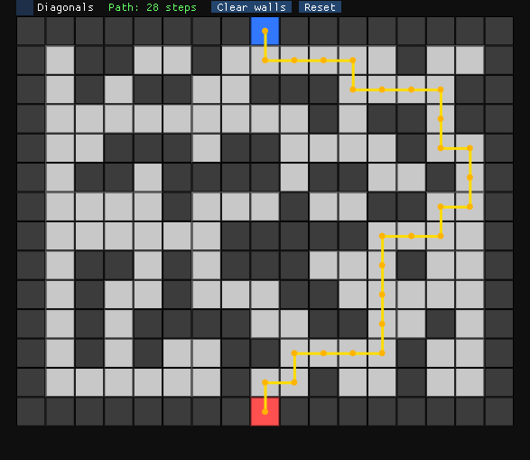
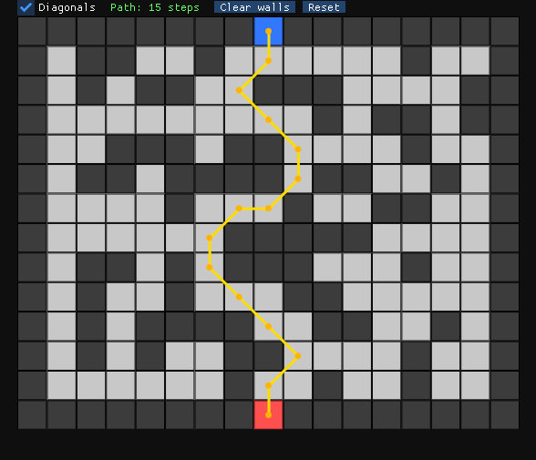

# PathX  
A lightweight, extensible C++ pathfinding engine with a built-in grid visualizer and an efficient A* implementation.

## Showcase



## Features

### A* Pathfinding Engine
- Fast, grid-based A* implementation  
- Supports obstacles, start/end placement, and dynamic updates  

### Grid Visualizer
- Click-to-paint walls  
- Real-time path visualization  

### Engine Architecture
- Modular C++ engine  
- Visualizer sandbox  
- Premake build scripts for VS2022/VS2026  

## Setup & Build Instructions

### 1. Clone the repository (recursive)
PathX uses submodules, so you **must** clone recursively:

```bash
git clone --recursive https://github.com/descreetStudios/PathX.git
```

If you already cloned normally:

```bash
git submodule update --init --recursive
```

### 2. Generate the Visual Studio solution
For VS2022:
```bash
run Generate_VS2022.bat
```
For VS2026:
```bash
run Generate_VS2026.bat
```

### 3. Build & Run
Open the generated .sln (or .slnx) file in Visual Studio and build the Visualizer project.
This launches the grid editor and A* visualizer.

## Visualizer Controls

### Basic Interaction
- **Left Click**: Toggle wall (obstacle) on/off
- **Shift + Left Click**: Place start node
- **Ctrl + Left Click**: Place end node

## A* Pathfinding Algorithm

A* (A-star) is a widely used pathfinding algorithm that finds the shortest path between two points while avoiding obstacles. It is both **optimal** and **efficient** when paired with an admissible heuristic.

## Core Idea

A* evaluates each node using the cost function:

\[
f(n) = g(n) + h(n)
\]

Where:

- \( g(n) \): cost from the start node to the current node  
- \( h(n) \): heuristic estimate from the current node to the goal  
- \( f(n) \): estimated total cost of the path through this node  

A* prioritizes nodes with the lowest \( f(n) \), balancing real cost and estimated cost.

## How A* Works

### 1. **Initialization**
- Add the start node to the *open list* (nodes to be evaluated).
- Set its \( g = 0 \) and compute its heuristic \( h \).

### 2. **Select the Best Node**
- Pick the node in the open list with the lowest \( f \)-cost.
- This is the most promising next step.

### 3. **Process Neighbors**
For each neighbor of the current node:
- Skip if it's a wall or already fully evaluated.
- Compute:
  - New \( g \)-cost (distance from start)
  - New \( h \)-cost (heuristic to goal)
  - New \( f = g + h \)
- If this path is better than any previously recorded path, update the neighbor.

### 4. **Move Node to Closed List**
- Once processed, the current node is marked as closed (no need to revisit).

### 5. **Repeat**
- Continue selecting the lowest-cost node and evaluating neighbors.
- Stop when:
  - The goal is reached, or  
  - The open list becomes empty (no path exists)

## Why A* Is Effective

- **Optimal**: Finds the shortest path when using an admissible heuristic  
- **Complete**: Always finds a path if one exists  
- **Efficient**: Explores only the most promising nodes  
- **Flexible**: Works on grids, graphs, navigation meshes, and more  

In PathX, A* is implemented on a grid with Manhattan-distance heuristics, making it ideal for tile-based movement.

## License
This project is licensed under the GPL-3.0 License.
See LICENSE.txt for details.

## Contributing
Contributions are welcome!
Feel free to open issues or submit pull requests.

## ⭐ Support the Project
If you find PathX useful, consider starring the repo — it helps visibility and future development.